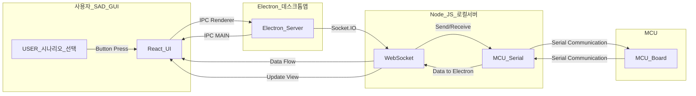

### 기술 스택


### 시스템 다이어그램

<br>


```mermaid
graph LR
    subgraph 사용자_SAD_GUI
        USER_시나리오_선택 -->|Button Press| React_UI
    end

    subgraph Electron_데스크톱앱
        React_UI -->|IPC Renderer| Electron_Server
        Electron_Server -->|IPC MAIN| React_UI
    end

    subgraph Node_JS_로컬서버
        Electron_Server -->|Socket.IO| WebSocket
        WebSocket -->|Data Flow| React_UI
        WebSocket -->|Send/Receive| MCU_Serial
    end

    subgraph MCU
        MCU_Serial -->|Serial Communication| MCU_Board
        MCU_Board -->|Serial Communication| MCU_Serial
    end

    MCU_Serial -->|Data to Electron| WebSocket
    WebSocket -->|Update View| React_UI
```

<br>

### 설치 방법

```bash
    mkdir test
    git init
    npm init
    npm i electron --save-dev
    npm i crete-readct-app app --template--save-dev
```
